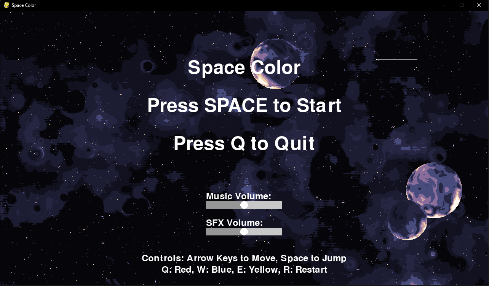
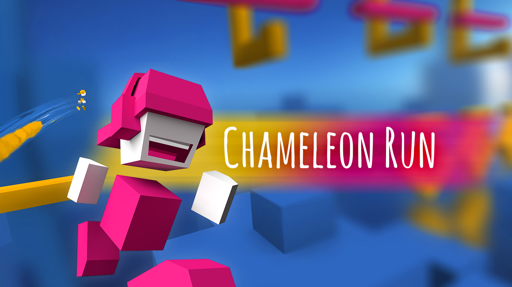
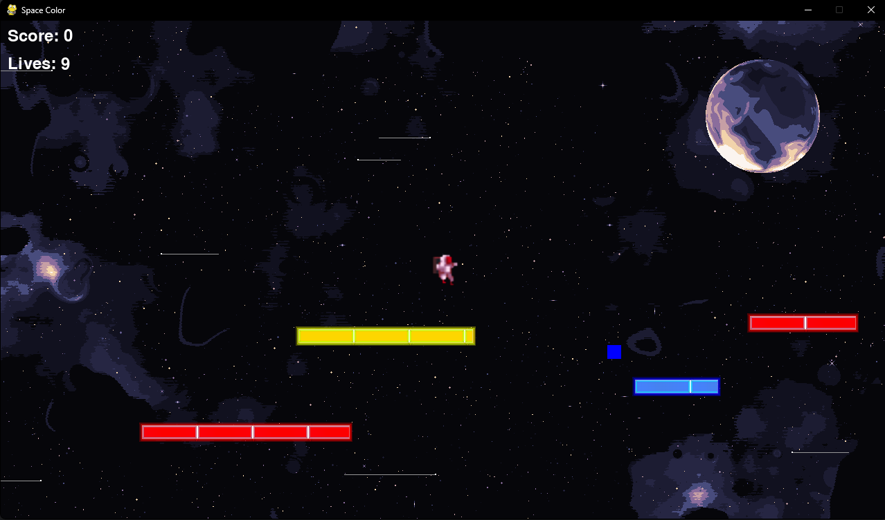
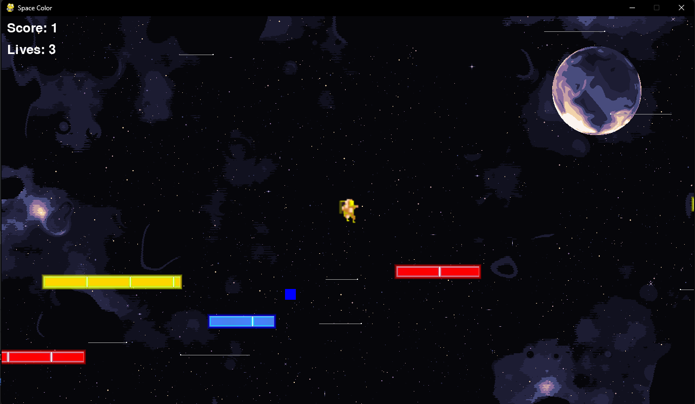

# **Space Color - Game Design Document**

Projekt obsahuje implementáciu platformovej hry v Pygame, ktorá bola vytvorená ako projekt pre predmet Objektové technológie.

**Autor**: Andrej Šima  
**Vybraná téma**: Color as a gameplay feature

---
## **1. Úvod**
Space Color je vesmírna platformová hra, kde hlavným herným prvkom je zmena farby astronauta pre interakciu s rôznofarebnými platformami. Hráč musí strategicky meniť farby, aby mohol prejsť cez platformy rovnakej farby a vyhnúť sa smrti pri kontakte s platformami inej farby.

### **1.1 Inšpirácia**
<ins>**Chameleon Run**</ins>  
Chameleon Run je populárna mobilná hra, kde hráč musí meniť farby svojej postavy pre prechod cez rôznofarebné platformy. Hra vyžaduje rýchle reflexy a strategické myslenie pri prechádzaní jednotlivými prekážkami.

### **1.2 Herný zážitok**
Cieľom hry je dostať sa čo najďalej v úrovni, pričom hráč musí správne meniť farby svojej postavy, aby mohol interagovať s platformami. Pri kontakte s platformou inej farby hráč stráca život. Hra kombinuje prvky sci-fi platformovej hry s farebným puzzle elementom.

### **1.3 Vývojový softvér**
- **Python/Pygame**: hlavný programovací jazyk a herný framework
- **PyCharm**: vývojové prostredie
- **Pixel art assets**: herná grafika

---
## **2. Koncept**
### **2.1 Prehľad hry**
Hráč ovláda astronauta, ktorý sa pohybuje medzi farebnými platformami vo vesmíre. Môže meniť svoju farbu medzi červenou, modrou a žltou, pričom môže stáť len na platformách rovnakej farby.

### **2.2 Interpretácia témy (Color as a gameplay feature)**
Farba je základným herným mechanizmom - hráč musí aktívne meniť farby svojej postavy, aby mohol interagovať s rôznymi platformami. Tento mechanizmus vytvára unikátnu hernú mechaniku, kde farba nie je len vizuálnym prvkom, ale kľúčovou súčasťou hrateľnosti.

### **2.3 Základné mechaniky**
- **Zmena farby**: hráč môže prepínať medzi tromi farbami (červená, modrá, žltá)
- **Platformy**: rôznofarebné platformy, na ktorých môže hráč stáť len ak má rovnakú farbu
- **Kolekcie**: zbieranie farebných orbs pre zmenu farby a bodov
- **Lives systém**: hráč má obmedzený počet životov
- **Parallax pozadie**: dynamické vesmírne pozadie pre lepší vizuálny efekt

---
## **3. Grafika**
### **3.1 Vizuálny štýl**
Hra využíva pixel art štýl s vesmírnou tématikou. Hlavná postava je animovaný astronaut s farebnými variantmi. Platformy majú jednoduchý, ale efektný dizajn s farebnými žiarivými efektmi.

### **3.2 Dizajn**
Herné prostredie je zasadené do vesmíru s dynamickým pozadím obsahujúcim hviezdy a paralaxové vrstvy. Každá platforma a zbierateľný predmet má svoju farebnú variantu, ktorá je jasne rozoznateľná.

---
## **4. Zvuk**
### **4.1 Hudba**
Hra obsahuje atmosférický soundtrack "Linkin Park - Somewhere I Belong (8 bit)", ktorý sa prehráva počas hrania. Hudba sa dá ovládať pomocou nastavenia hlasitosti v menu.

### **4.2 Zvukové efekty**
Všetky herné zvukové efekty boli vytvorené pomocou nástroja SFXR:
- Zvuk skoku
- Zvuk zbierania collectibles
- Zvuk pri smrti

---
## **5. Herný zážitok**
### **5.1 Používateľské rozhranie**
- Hlavné menu s možnosťou začať hru a ukončiť hru
- Pause menu s možnosťou pokračovať alebo sa vrátiť do hlavného menu
- HUD zobrazujúci skóre a počet životov
- Nastavenia hlasitosti v menu

### **5.2 Ovládanie**
<ins>**Klávesnica**</ins>
- **Šípky**: pohyb vľavo/vpravo
- **Medzerník**: skok
- **Q**: zmena na červenú farbu
- **W**: zmena na modrú farbu
- **E**: zmena na žltú farbu
- **P**: pauza
- **R**: restart úrovne

---
## **6. Credits**
### **Grafika**
- **Astronaut Sprites**: [Free Space Runner Pack](https://mattwalkden.itch.io/free-space-runner-pack) od Matt Walkden
- **Pozadie**: Generované pomocou [Space Background Generator](https://deep-fold.itch.io/space-background-generator)

### **Zvuk**
- **Soundtrack**: ["Linkin Park - Somewhere I Belong (8 bit)"](https://www.youtube.com/watch?v=4WYjb0P7L1k)
- **Herné zvuky**: Vytvorené pomocou nástroja [SFXR](https://www.drpetter.se/project_sfxr.html)
